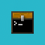
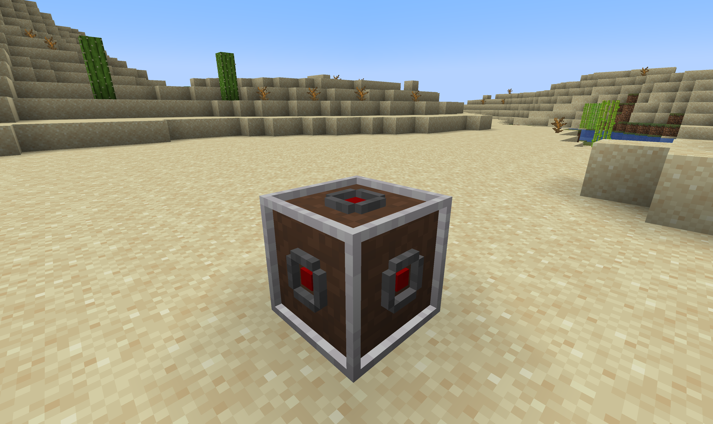
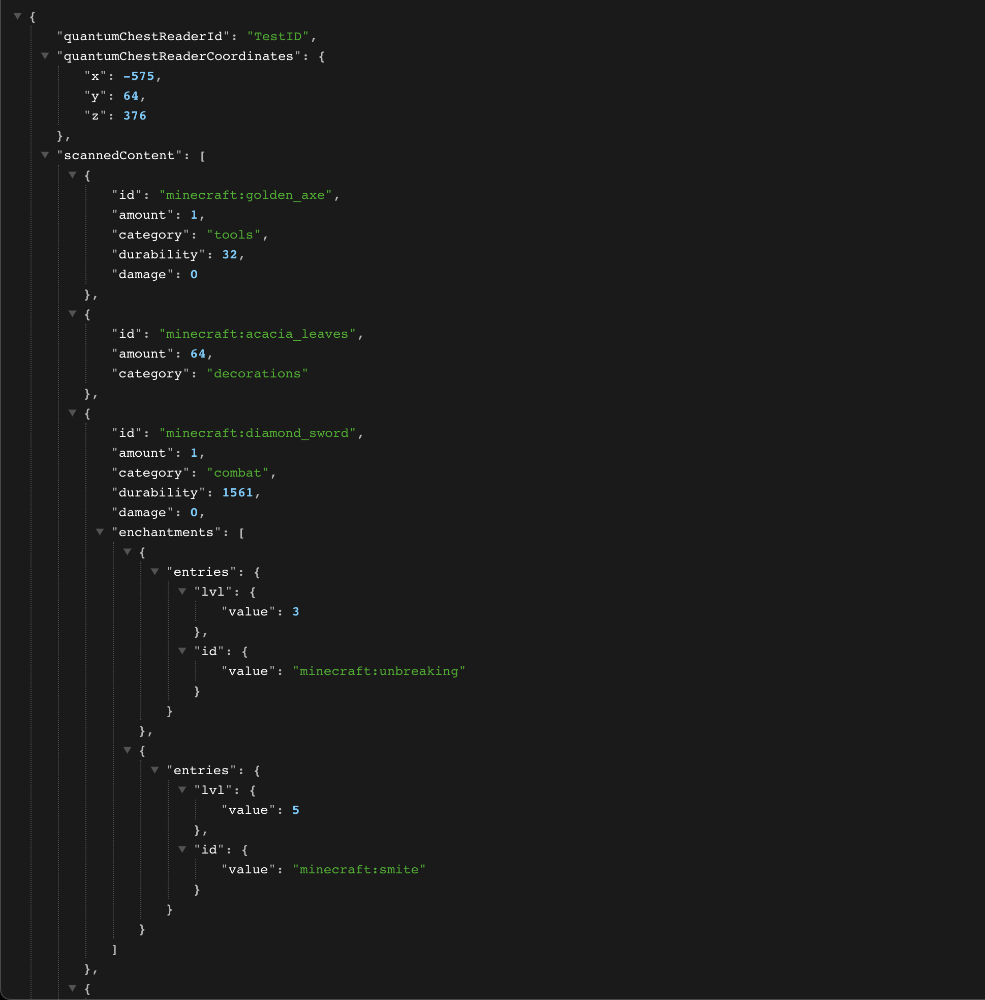

[![Contributors][contributors-shield]][contributors-url]
[![Forks][forks-shield]][forks-url]
[![Stargazers][stars-shield]][stars-url]
[![Issues][issues-shield]][issues-url]

<!-- PROJECT HEADER -->
<br />
<p align="center">
  

  <h3 align="center">SortSavvy</h3>

  <p align="center">
    A fabric mod to organize and have fun with sorting systems
    <br />
    <br />
    ·
    <a href="https://github.com/beuluis/SortSavvy/issues">Report Bug</a>
    ·
    <a href="https://github.com/beuluis/SortSavvy/issues">Request Feature</a>
    ·
  </p>
</p>

<!-- ABOUT THE PROJECT -->

## About The Project

I wrote this mod for a server my friends and I play on. We want to build an awesome sorting system with some extended functionality.

The current features are:

- Adding a block that exposes the content of a chest via a rest API

## Installation

Download the jar file from CurseForge or install it directly in the launcher.

## Blocks

### QuantumChestReader



#### Crafting

TBD

## API

Port for now `8082`



### Authentication

All endpoints need to be called with a bearer token.

```
Authorization: Bearer <token>
```

### `GET /quantum-chest-reader/{quantumChestReaderId}`

Get a QuantumChestReader results based on the provided ID.

#### `200 OK` request successful

Returns [QuantumChestReaderResponse](#quantumchestreaderresponse)

#### `400 BAD REQUEST` parameter was not provided

Returns [ErrorResponse](#errorresponse) with

```JSON
{
    "error": "id-parameter-not-provided",
    "message": "ID parameter not provided"
}
```

#### `404 NOT FOUND` QuantumChestReader with the provided it not found

Returns [ErrorResponse](#errorresponse) with

```JSON
{
    "error": "id-no-found",
    "message": "QuantumChestReader with ID $quantumChestReaderId not found"
}
```

#### `404 NOT FOUND` inventory not found

Returns [ErrorResponse](#errorresponse) with

```JSON
{
    "error": "no-inventory-found",
    "message": "No inventory found at x=$x y=$y z=$z",
    "context": {
        "x": 12,
        "y": 64,
        "z": 12
    }
}
```

### `GET /quantum-chest-reader/all`

Get all QuantumChestReader results.

#### `200 OK` request successful

Returns array of [QuantumChestReaderResponse](#quantumchestreaderresponse)

### Interfaces

#### `Coordinates`

```typescript
interface Coordinates {
  x: number;
  y: number;
  z: number
}
```

#### `QuantumChestReaderScannedContent`

```typescript
interface QuantumChestReaderScannedContent {
    id: string;
    amount: number;
    category?: string;
    durability?: number;
    damage?: number;
    enchantments?: unknown[]; // Did not looked up the structure but the java class is 'NbtElement'
}
```

#### `QuantumChestReaderResponse`

```typescript
interface QuantumChestReaderResponse {
  quantumChestReaderId: string;
  quantumChestReaderCoordinates: Coordinates;
  scannedContent: QuantumChestReaderScannedContent[]
}
```

#### `ErrorResponse`

```typescript
interface Coordinates {
  error: string;
  message: string;
  context?: unknown;
}
```

## TODO

- [ ] Add crafting recipes
- [ ] Add filter organize block
- [ ] Reuse functions for webserver
- [ ] Add command to rescan all placed QuantumChestReaders
- [ ] Add support for other dimensions
- [ ] Add auth token for webserver
- [ ] Add config
- [ ] Make port configurable
- [ ] Make auth token configurable
- [ ] Update textures a bit

<!-- CONTRIBUTING -->

## Contributing

Contributions are what make the open source community such an amazing place to learn, inspire, and create. Any contributions you make are **greatly appreciated**.

1. Fork the Project
2. Create your Feature Branch (`git checkout -b feature/AmazingFeature`)
3. Commit your Changes (`git commit -m 'Add some AmazingFeature'`)
4. Push to the Branch (`git push origin feature/AmazingFeature`)
5. Open a Pull Request

<!-- CONTACT -->

## Contact

Luis Beu - me@luisbeu.de

<!-- MARKDOWN LINKS & IMAGES -->
<!-- https://www.markdownguide.org/basic-syntax/#reference-style-links -->

[contributors-shield]: https://img.shields.io/github/contributors/beuluis/SortSavvy.svg?style=flat-square
[contributors-url]: https://github.com/beuluis/SortSavvy/graphs/contributors
[forks-shield]: https://img.shields.io/github/forks/beuluis/SortSavvy.svg?style=flat-square
[forks-url]: https://github.com/beuluis/SortSavvy/network/members
[stars-shield]: https://img.shields.io/github/stars/beuluis/SortSavvy.svg?style=flat-square
[stars-url]: https://github.com/beuluis/SortSavvy/stargazers
[issues-shield]: https://img.shields.io/github/issues/beuluis/SortSavvy.svg?style=flat-square
[issues-url]: https://github.com/beuluis/SortSavvy/issues
[license-shield]: https://img.shields.io/github/license/beuluis/SortSavvy.svg?style=flat-square
