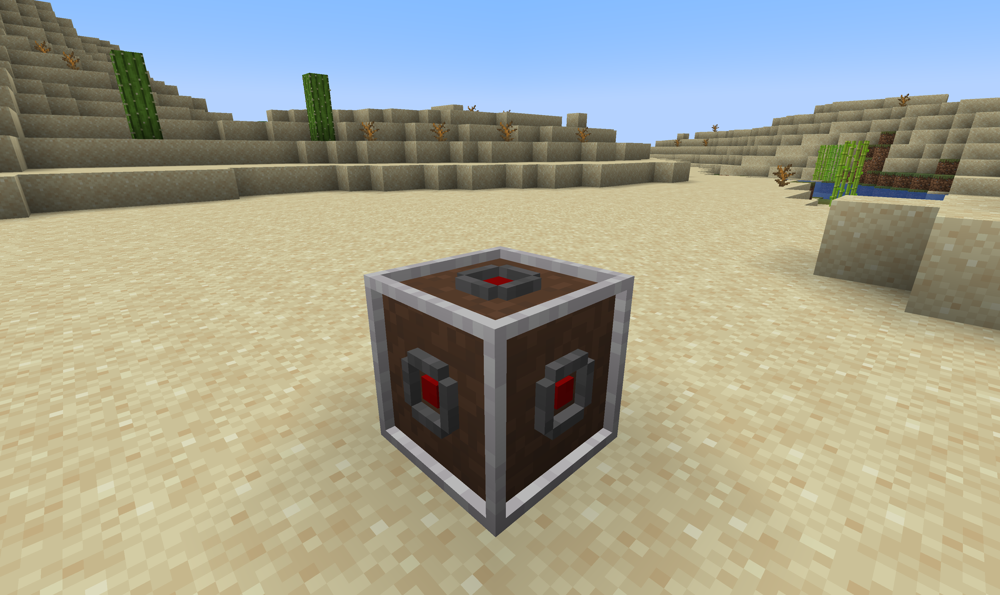
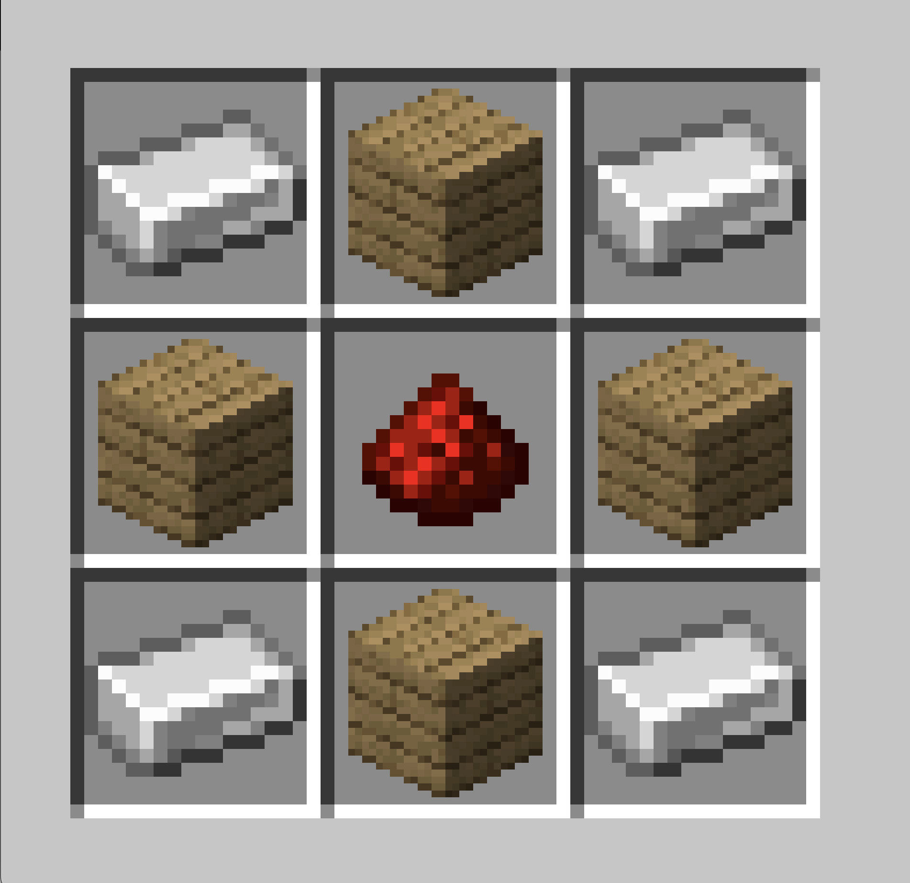

[![Contributors][contributors-shield]][contributors-url]
[![Forks][forks-shield]][forks-url]
[![Stargazers][stars-shield]][stars-url]
[![Issues][issues-shield]][issues-url]

<!-- PROJECT HEADER -->
<br />
<p align="center">
  

<h3 align="center">SortSavvy</h3>

  <p align="center">
    A fabric mod to organize and have fun with sorting systems
    <br />
    <br />
    ·
    <a href="https://github.com/beuluis/SortSavvy/issues">Report Bug</a>
    ·
    <a href="https://github.com/beuluis/SortSavvy/issues">Request Feature</a>
    ·
  </p>
</p>

<!-- ABOUT THE PROJECT -->

## About The Project

I wrote this mod for a server my friends and I play on. We want to build an awesome sorting system with some extended
functionality.

The current features are:

- A block that exposes the content of a chest via a rest API

Planned features are:

- A block that allows to set Create filters via a rest API
- A block that send a message over MQTT or websocket when activated via redstone

## Installation

Download the jar file from CurseForge or install it directly in the launcher.

## Blocks

### QuantumInventoryReader



#### Crafting



## API

 <!-- TODO: update example -->

### Config

The config can be found in your world folder in the subdirectory `serverconfig`

### Authentication

All endpoints need to be called with a bearer token. The token can be found in the config file.

```
Authorization: Bearer <token>
```

### `GET /quantum-inventory-reader/{quantumChestReaderId}`

OpenAPI docs WIP

### `GET /quantum-inventory-reader/all`

OpenAPI docs WIP

## TODO

- [ ] Add filter organize block
- [ ] Add redstone websocket block
- [ ] Add command to rescan all placed QuantumChestReaders

<!-- CONTRIBUTING -->

## Contributing

Contributions are what make the open source community such an amazing place to learn, inspire, and create. Any
contributions you make are **greatly appreciated**.

1. Fork the Project
2. Create your Feature Branch (`git checkout -b feature/AmazingFeature`)
3. Commit your Changes (`git commit -m 'Add some AmazingFeature'`)
4. Push to the Branch (`git push origin feature/AmazingFeature`)
5. Open a Pull Request

<!-- CONTACT -->

## Contact

Luis Beu - me@luisbeu.de

<!-- MARKDOWN LINKS & IMAGES -->
<!-- https://www.markdownguide.org/basic-syntax/#reference-style-links -->

[contributors-shield]: https://img.shields.io/github/contributors/beuluis/SortSavvy.svg?style=flat-square

[contributors-url]: https://github.com/beuluis/SortSavvy/graphs/contributors

[forks-shield]: https://img.shields.io/github/forks/beuluis/SortSavvy.svg?style=flat-square

[forks-url]: https://github.com/beuluis/SortSavvy/network/members

[stars-shield]: https://img.shields.io/github/stars/beuluis/SortSavvy.svg?style=flat-square

[stars-url]: https://github.com/beuluis/SortSavvy/stargazers

[issues-shield]: https://img.shields.io/github/issues/beuluis/SortSavvy.svg?style=flat-square

[issues-url]: https://github.com/beuluis/SortSavvy/issues

[license-shield]: https://img.shields.io/github/license/beuluis/SortSavvy.svg?style=flat-square
